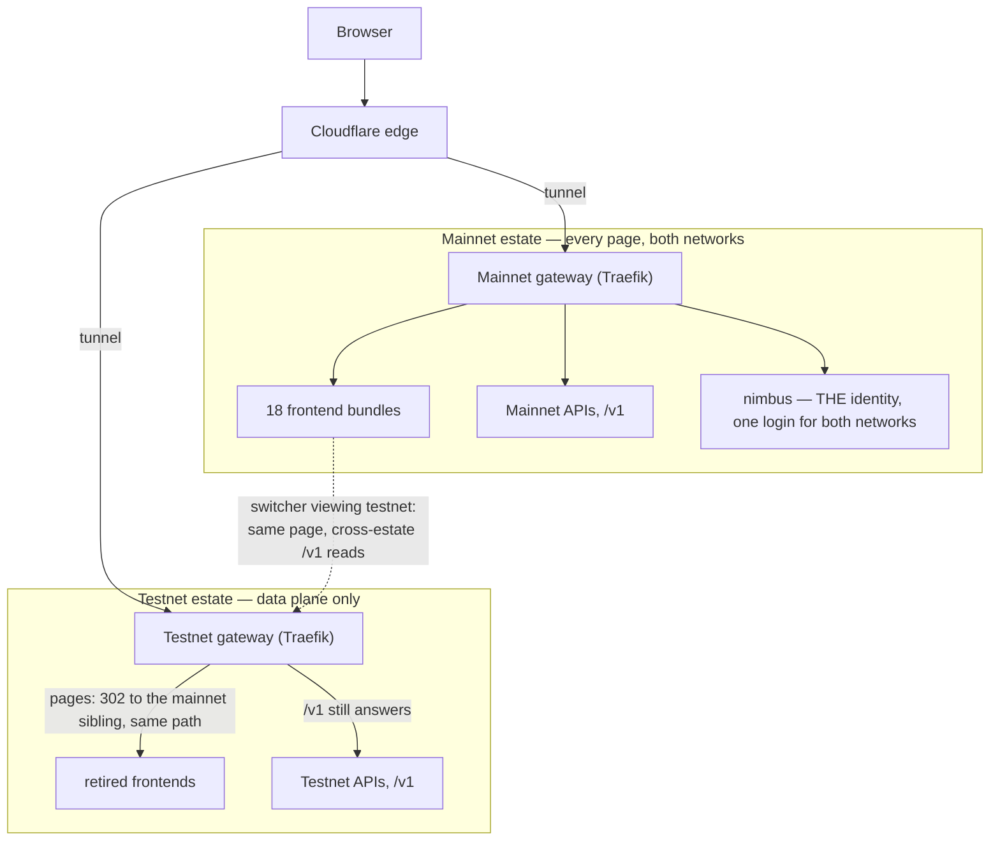
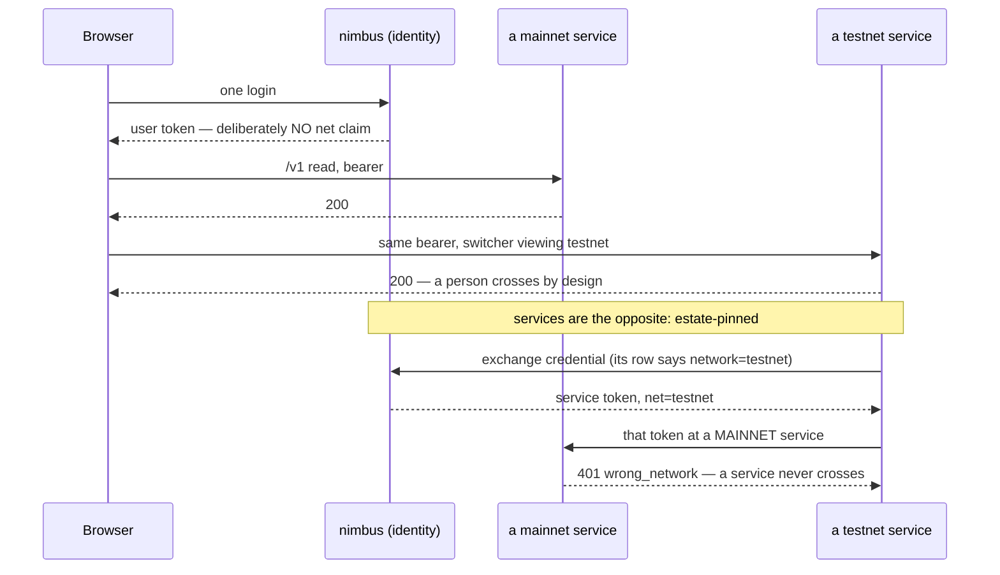
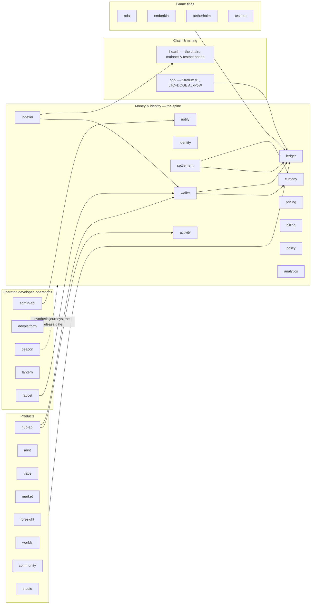
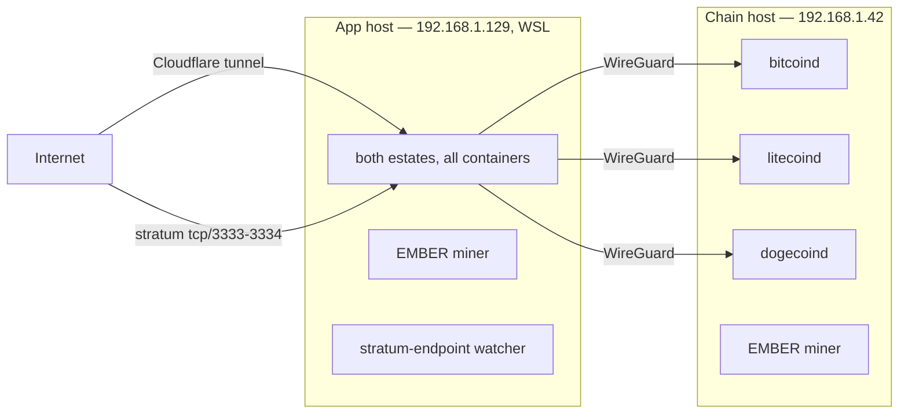
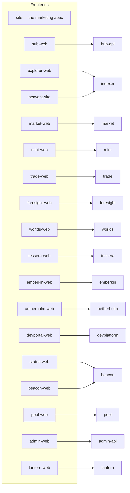

# CloudsForge

A crypto platform built around a coin you can mine on your own computer: a chain, six products, an
operator console and a developer platform, sharing one account, one wallet and one double-entry
ledger.

Everything below is measured, not estimated. Where something does not work, it says so.

---

## The estate, counted

| | |
| --- | --- |
| Repositories, public | **69** |
| Repositories, archived read-only and private | 10 pre-migration predecessors, each naming its successors |
| Services that bind a port | **30** — 27 services and 3 ops, plus a service template that never deploys |
| Frontends | **18** |
| TypeScript / TSX files | **2,557** |
| Lines of TypeScript, blank lines excluded | **779,982** |
| — of which code | **542,243** |
| — of which comment | **237,739** |
| Test files (`node:test`, no other runner) | **927** |
| Distinct database tables | **254** |
| HTTP route declarations | **520** |
| Engineering documents | **39** |
| Browser scenarios specified | **388** |

Counted on **2026-08-12** by [`org/tools/count-estate.sh`](https://github.com/cloudsforge-online/micro-org/blob/main/tools/count-estate.sh),
which is new and is the point of this revision. Every figure above used to be counted by hand, and
the note this paragraph replaces recorded what that cost: two repository rows had drifted from 61
and 9, and the document row said 27 against 30 documents on disk — three of eleven figures wrong,
found by accident.

A hand count also cannot be compared with itself. The previous "556,610 lines of TypeScript" does
not say whether it counted blank lines, comments, `.tsx`, or `dist/`, so this table cannot honestly
claim the difference is all growth. From here it can: the method is now the artifact and the
numbers fall out of it.

**The method, stated so it can be disagreed with.** Blank lines are excluded — 61,050 of them —
because a blank line is formatting, not work. Comments are counted **separately** rather than
folded into the headline or discarded: 237,739 comment lines against 542,243 of code is a real
property of this codebase and the wrong thing to either hide or quietly add to a total. `dist`,
`build`, `coverage` and `node_modules` are excluded, because vendored and generated code is not
work this organisation did. Repository counts come from the organisation over the API, never from
a checkout, and the script refuses to publish code figures at all if the disk is missing a public
repository — in that case every line below it would be an undercount. `tokei` produces the
published figures and `cloc` runs beside it as an independent cross-check; they currently agree
within 4.6%, and a gap beyond 10% means one of them has started mis-parsing something.

**Two figures deserve their caveats.** *HTTP route declarations* fell from 604 to 520, which is
almost certainly a change of method rather than a shrinking API: the old number's definition was
not recorded, and the new one counts route objects — `{ method: 'GET', path: … }` — in non-test
TypeScript. It is reproducible from today, and not comparable backwards. *Lines* rose steeply for
the same reason, plus 630 new files.

---

## The chain

**Hearth** is written here rather than forked. It is a proof-of-work chain that speaks Ethereum.

| | |
| --- | --- |
| Consensus | Homefire proof-of-work — CPU-mined, memory-hard, ASIC-resistant |
| Account model | EVM, written from scratch: interpreter, opcodes, gas, memory, stack, `uint256`, `bn128`, `blake2f`, precompiles |
| Chain IDs | **7411** mainnet, **7412** testnet |
| Block time | 15 seconds |
| Decimals | 18 |
| Block reward | 6 EMBER at genesis, decaying to a perpetual tail of 0.3 EMBER |
| Premine | none |
| Ethereum VMTests | **609 / 609** |
| Ethereum GeneralStateTests | **20,077 / 20,077** |

Because it is EVM-compatible, ordinary Ethereum tooling works against it, and a seed phrase derived
at `m/44'/60'` restores in wallets nobody here wrote.

### Two networks, and how to tell them apart

Both are public as of 2026-08-05. Everything in this section was measured over the public internet
on that date.

| | Mainnet | Testnet |
| --- | --- | --- |
| Chain ID | **7411** (`0x1cf3`) | **7412** (`0x1cf4`) |
| JSON-RPC | `https://rpc.cloudsforge.online` | `https://rpc-testnet.cloudsforge.online` |
| Peer-to-peer | `wss://p2p.cloudsforge.online/p2p` | `wss://p2p-testnet.cloudsforge.online/p2p` |
| Surfaces | `<surface>.cloudsforge.online` — **both networks**, via the in-app switcher | `<surface>-testnet.cloudsforge.online` answers **302** to the mainnet sibling; its `/v1` API still answers |
| Coins come from | mining only | the faucet, free |
| If it is lost | it is gone | it did not matter |

Each RPC was asked `eth_chainId` over the public internet and answered its own chain — `0x1cf3` and
`0x1cf4`. The two IDs are deliberately different: if both networks declared 7411, every testnet
transaction would be replayable on mainnet under EIP-155. Mainnet was past **block 1,140** at that
measurement — the genesis is a day old, so "live" here means *reachable*, not *established*, and
observed block spacing on a chain this young runs well above the 15-second target while difficulty
settles. The RPC hosts are **POST only**; a `GET` returns 405.

**The environment is a suffix on the first label, never a second label.**
`hub-testnet.cloudsforge.online` is the testnet Hub. **`hub.testnet.cloudsforge.online` is not an
address here** — it never resolved and any document still showing that form is out of date.
Cloudflare's Universal SSL covers a single-label wildcard only, so every two-label testnet hostname
failed the TLS handshake at the edge; the naming scheme was changed rather than a paid certificate
bought. The one exception is the testnet front page itself, `testnet.cloudsforge.online`, where
there is no subdomain to suffix and the label stands alone.

**What each network is for, stated so the two cannot be confused.** Mainnet is the real chain: its
balances are permanent, its coins are mined and never given away, and it is not reset. **Testnet
exists to be thrown away.** Its EMBER is handed out free by the testnet faucet at
[network-testnet.cloudsforge.online/faucet](https://network-testnet.cloudsforge.online/faucet), it is
worthless by construction, and the chain may be restarted from genesis without notice. Nothing sent
to a `-testnet` address should ever be something anyone minds losing.

**EMBER has no monetary value on either network.** No market, no listing, no liquidity, no price.
Mainnet becoming reachable does not change that, and nothing on this page should be read as
suggesting otherwise. Testnet EMBER is worthless on purpose; mainnet EMBER is worthless so far.

---

## What is running

**41 containers**, composed against real Postgres — one database per service, no shared schema, no
service reading another's tables. The estate boots from one command and includes the chain.

**Continuous integration: 58 green, 1 red.** Every repository runs the same reusable workflow:
typecheck, its own suite against a real Postgres, the estate rules, a container that must boot and
answer `/livez`, and a secret-hygiene sweep. **A suite that skips its database tests fails the
build.** (The remainder is the profile repository, which has no workflow.)

That number was **zero** this morning — not zero green, zero *runs*. Every job in the organisation
had been failing in under fifteen seconds with no steps executed, on a billing block. Making the
estate public restored unlimited Actions, and within the hour CI had caught a cross-repository
contract drift, a documentation gap, a container image job that had never once run for any service,
and a flaky test that was hiding a real defect in an erasure path.

---

## Where it is running

Public as of 2026-08-05, served from home hardware behind a Cloudflare Tunnel — since 2026-08-09
**two machines**, not one: an app host running every container of both estates, and a chain host
running the external chain daemons and a second EMBER miner, linked by WireGuard. The
architecture section below draws it. There is still no redundancy and no failover; a backup
runner now ships state off the app host on a schedule, but **no restore has ever been
rehearsed**, and a backup that has never been restored is a hope, not a backup.

Every row below was fetched over the public internet on **2026-08-05** and returned 200. That is a
measurement on a date, not a promise about tomorrow: one home server has no uptime commitment, and
the live truth is on the [status page](https://status.cloudsforge.online) rather than on this one.

**Revised 2026-08-14 — the combined view.** The testnet links below now answer **302** to their
mainnet sibling (measured over the public internet on 2026-08-14: `hub-testnet.` → `hub.`,
`testnet.` → the apex, both 302; `explorer-testnet.…/v1` still 200). One set of pages serves both
networks through the switcher; the testnet column is kept because the hostnames still work — they
carry old links to the right place, and their APIs are load-bearing. The architecture section
above draws the whole arrangement.

| Surface | Mainnet | Testnet |
| --- | --- | --- |
| The marketing site | [cloudsforge.online](https://cloudsforge.online) | [testnet.cloudsforge.online](https://testnet.cloudsforge.online) |
| Forge Hub | [hub.](https://hub.cloudsforge.online) | [hub-testnet.](https://hub-testnet.cloudsforge.online) |
| Forge Network, and the faucet | [network.](https://network.cloudsforge.online) | [network-testnet.](https://network-testnet.cloudsforge.online) |
| Block explorer | [explorer.](https://explorer.cloudsforge.online) | [explorer-testnet.](https://explorer-testnet.cloudsforge.online) |
| Forge Market | [market.](https://market.cloudsforge.online) | [market-testnet.](https://market-testnet.cloudsforge.online) |
| Forge Create | [create.](https://create.cloudsforge.online) | [create-testnet.](https://create-testnet.cloudsforge.online) |
| Forge Trade | [trade.](https://trade.cloudsforge.online) | [trade-testnet.](https://trade-testnet.cloudsforge.online) |
| Forge Foresight | [foresight.](https://foresight.cloudsforge.online) | [foresight-testnet.](https://foresight-testnet.cloudsforge.online) |
| Forge Worlds | [worlds.](https://worlds.cloudsforge.online) | [worlds-testnet.](https://worlds-testnet.cloudsforge.online) |
| Tessera | [tessera.](https://tessera.cloudsforge.online) | [tessera-testnet.](https://tessera-testnet.cloudsforge.online) |
| Kindred | [emberkin.](https://emberkin.cloudsforge.online) | [emberkin-testnet.](https://emberkin-testnet.cloudsforge.online) |
| Aetherholm | [aetherholm.](https://aetherholm.cloudsforge.online) | [aetherholm-testnet.](https://aetherholm-testnet.cloudsforge.online) |
| Public status page | [status.](https://status.cloudsforge.online) | [status-testnet.](https://status-testnet.cloudsforge.online) |
| Developer console and docs | [developers.](https://developers.cloudsforge.online) | [developers-testnet.](https://developers-testnet.cloudsforge.online) |
| Hearth JSON-RPC | `rpc.` — chain **7411** | `rpc-testnet.` — chain **7412** |

Suffix every abbreviated cell with `cloudsforge.online`. Three operator consoles — `admin`, `beacon`
and `lantern` — answer on both networks and are not for public use, which is why they are not linked
here. That is **16 UI surfaces plus the apex on each network, all 200 on 2026-08-05**.

**Six hostnames deliberately serve no page**, and are listed so nobody reports the 404 as a fault:
`nimbus` (single sign-on and token issuance), `pay` (billing and wallet), `vault` (custody),
`account`, `api` and `worlds-api`. They are APIs. `servesUi: false` in the surface registry is the
field that says so, and each answers `/livez` while returning 404 at `/` — `nimbus`, `pay` and
`vault` were confirmed doing exactly that on both networks.

**The public API is up.** `api.cloudsforge.online` serves on both networks, answering `404
text/plain` on an unmatched path. It spent part of 2026-08-05 returning 502 — a `cf-api-catchall`
router pointing at `http://127.0.0.1:1`, a gateway backend fault rather than a tunnel or DNS one —
and that is fixed.

**What still does not work, listed rather than omitted.** `worlds-api.cloudsforge.online` has no
DNS record and is **not a defect**: the game API was consolidated into `api.`, and the hostname is
retired rather than broken. (`www.cloudsforge.online`, which this paragraph used to report as not
resolving at all, answers **301** to the apex — measured 2026-08-14.)

---

## How it is built

**One repository per deployable.** A service owns its schema, its migrations, its tests and its
container. Nothing shares a database.

**Events go Postgres outbox → signed HTTP → inbox**, deduplicated on `(topic, event_id)`. There is
no message broker. Currently **55 registered topics from 15 producers**, with 126 emit sites
derived from source.

**Authorisation is scoped per caller.** **61 scopes**, 56 live and 5 deprecated, with 59 demanded by
gates across 27 repositories. A scope that no gate demands, and a gate demanding a scope that is not
registered, both fail the build.

**Invariants live in the schema**, not in handlers: `CHECK` constraints, deferred constraint
triggers, generated columns, partial unique indexes and GiST exclusion constraints. The ledger's
"debits equal credits, per entry, per asset" is a deferred trigger, so it holds against a `psql`
session and a future service, not only against code that went through the API.

**Four invariants belong to the estate rather than to any repository in it**, and run across a full
clone: every service must agree on the ledger account types it names; every registered scope must be
demanded somewhere; every event topic must have a producer and a consumer that agree it exists; and
no route may return private key material — a body scan across roughly 498 routes. **Each carries a
canary: a deliberately broken case the check must go red on.** A check that cannot fail is not a
check.

---

## The architecture, drawn

Revised **2026-08-14**, at release **2026.08.38**, and drawn from that release's manifest — 48
images, every one listed below, none omitted. The big change it records: **the combined view**. As
of 2026-08-14 there is ONE set of frontends, on the mainnet hostnames, serving BOTH networks
through an in-app **Mainnet | Testnet** switcher. The `-testnet` page hostnames answer **302** to
their mainnet sibling with the path intact; their `/v1` APIs still answer, because the combined
view's cross-network reads depend on them. Testnet survives as a data plane — chain, money tier,
APIs — with its frontends, its identity and its synthetic monitor retired: stopped, not deleted,
and the redirects are temporary-code, so the whole thing can be rolled back
(`micro-deploy/runbooks/runbook-combined-view-rollback.md`).

### One estate of pages, two networks

The switcher is **in-memory, per tab, never persisted** — the viewed network defaults to the
hostname's own and is always on screen, with testnet data under the amber band. That rule has scar
tissue behind it (`explorer-web/src/lib/network.ts`) and a test that fails if anyone stores it.

### One identity, and why sharing it is safe

One account signs in once and reads both networks; a **service** must never cross. The asymmetry
is the design, and it is carried by the `net` claim:

Every service verifies against the same JWKS and is armed with its own estate's name
(`AUTH_EXPECTED_NETWORK`); the estate a credential mints for is a **column on the credential row**,
read the way the service name is — a caller can name neither its own service nor its own estate.

### Every service — the 30 that bind a port

Drawn by tier. Every arrow is a real, load-bearing call path; the tiers otherwise talk through
events (outbox → signed HTTP → inbox), not through each other's databases.

Two machines carry it. The **app host** runs everything above in containers (Windows, inside WSL —
Linux containers need a Linux kernel). The **chain host** runs the external chain daemons —
`bitcoind`, `litecoind`, `dogecoind` — as host processes, reached over a WireGuard link; both hosts
mine EMBER. A standalone **stratum-endpoint** watcher observes the public IP and republishes the
pool's stratum address when it moves.

### Every frontend — the 18 that ship

Each bundle is static files behind the gateway; `/v1` on the same hostname goes to the API that
serves it. All of them carry the network switcher; the three with in-app network context —
explorer, hub, the network site — swap their **data** in place.

That is 18, not the 16 an earlier revision of this page listed: `beacon-web`, `lantern-web` and
`pool-web` ship and were missing, and `micro-foresight-admin-web` is archived and does not — its
panel's job moved into the operator console. 30 services + 18 frontends = the manifest's 48.

---

## What is true today, and what is not

Honest status of the claim that this is one platform rather than six products with a shared logo.

| | | |
| --- | --- | --- |
| One account signs into everything, once | **works** | |
| One wallet, whichever product you came from | **works** | one wallet service, one set of screens |
| One portfolio — a single number for what you hold | **works** | composed by `hub-api` |
| One activity history across money, assets and play | **works** | `activity` owns the canonical record |
| One set of notifications and preferences | **works** | |
| One operator view | **works** | every topic it consumes now has a producer |
| One ledger that reconciles against the chain | **works, with a caveat** | driven clean against the live testnet at drift **exactly 0**, and proven to refuse and re-freeze when custody was emptied. The four tests that prove it end-to-end need two checkouts, so CI does not run them |
| One identity — same profile everywhere | partial | one user row; no profile beyond a handle |
| Assets made in one product usable in others | partial | the entitlement bridge exists; consumption is starting |
| The same money earns everywhere, not just spends | partial | **two** surfaces credit a seller today, not one |
| A third party can build on all of it | partial | the platform and SDK exist, the surfaces are publicly reachable on both networks, and `api.cloudsforge.online` now serves after a 502 was fixed on 2026-08-05. Partial because nobody outside the project has built anything against it yet |

**The estate is now serving the public on both networks**, and the qualifications matter as much as
the fact. Measured 2026-08-05, over the public internet, on a publicly trusted certificate — Google
Trust Services, via Cloudflare: **all 16 UI surfaces plus the apex return 200 on mainnet, and all 16
plus `testnet.cloudsforge.online` return 200 on testnet.** Both JSON-RPC endpoints serve their own
chain. `nimbus`, `pay` and `vault` answer `/livez` on both.

What that does **not** mean: it all runs on **two home machines** behind one Cloudflare Tunnel —
no redundancy, no failover, and no backup restore ever rehearsed. It is reachable, and it has had
no load that was not ours.

**Money in flight is being unified.** Shards, an internal unit, are being removed in favour of EMBER
denominated in **Sparks** — one Spark is 10⁻⁶ EMBER, a display denomination and deliberately never a
second asset code, because the ledger balances per asset code and a second one would let the two
halves of the same money drift apart. The rule underneath: **no balance may exist that the chain
does not back.**

---

## The full ecosystem

Everything that exists, by what it owns. Descriptions are the registry's own, not a summary of them.

### Money and identity — the spine

Spine never appears in a product grid, because an account is not something a person chooses; it is
something they are given.

| Service | Owns |
| --- | --- |
| [`micro-identity`](https://github.com/cloudsforge-online/micro-identity) | Accounts, credentials, MFA, sessions, devices, SSO exchange, JWKS, orgs, consents |
| [`micro-ledger`](https://github.com/cloudsforge-online/micro-ledger) | Chart of accounts, journal, postings, balances projection, reservations, reconciliation |
| [`micro-wallet`](https://github.com/cloudsforge-online/micro-wallet) | Wallet registry, external links, deposit addresses, withdrawals, conversions, portfolio |
| [`micro-custody`](https://github.com/cloudsforge-online/micro-custody) | HD seeds, key generation, encryption envelope, signing policy, treasury pins, export |
| [`micro-settlement`](https://github.com/cloudsforge-online/micro-settlement) | Treasuries, sweeps, outbound transactions, broadcast, confirmation tracking |
| [`micro-pricing`](https://github.com/cloudsforge-online/micro-pricing) | Market sources, median oracle, administered prices, rate history, valuation |
| `micro-billing` | Products, prices, entitlements, subscriptions, usage, invoices, payouts, revenue share |
| [`micro-policy`](https://github.com/cloudsforge-online/micro-policy) | Rules, limits, velocity counters, trusted addresses, cooling-off, approvals, freezes |
| [`micro-indexer`](https://github.com/cloudsforge-online/micro-indexer) | Blocks, transactions, receipts, logs, balances, transfers, reorgs, provider health |
| `micro-activity` | Canonical activity records, event inbox, feed cursors, feed query API |
| [`micro-notify`](https://github.com/cloudsforge-online/micro-notify) | Preferences, templates, notifications, deliveries, digests, webhooks, broadcasts |
| [`micro-analytics`](https://github.com/cloudsforge-online/micro-analytics) | Pseudonymised product event store, funnels, cohorts, retention, metric definitions |

[`micro-analytics`](https://github.com/cloudsforge-online/micro-analytics) never stores a raw subject. A pseudonym is salted per person and the salt is the
only thing erasure destroys — a plain `HMAC(user_id, pepper)` would be a pure function of two values
that both survive, so it could not be erased at all.

### The products

| Sold as | Service | Owns |
| --- | --- | --- |
| Forge Network | `hearth` | The chain itself: node, mining, RPC, contracts, SDK |
| — | [`micro-pool`](https://github.com/cloudsforge-online/micro-pool) | The mining pool: Stratum v1, jobs, shares, workers, payouts through the ledger, LTC+DOGE AuxPoW merge-mining |
| Forge Create | [`micro-mint`](https://github.com/cloudsforge-online/micro-mint) | Token orders, deployment lifecycle, token registry, token pages, contract templates. Real OpenZeppelin contracts, testnet by default |
| Forge Trade | [`micro-trade`](https://github.com/cloudsforge-online/micro-trade) | Strategy catalogue, backtests, bots, fills, allocations, fee settlement, performance. **Free until it makes money** — the only charge is a share of a live bot's gains above a high-water mark. Not an exchange |
| Forge Market | [`micro-market`](https://github.com/cloudsforge-online/micro-market) | Listings, offers, auctions, orders, escrow refs, collections, moderation, disputes. The escrow is a **ledger reservation**, not a balance anyone holds |
| Forge Foresight | [`micro-foresight`](https://github.com/cloudsforge-online/micro-foresight) | Prediction markets: registry and lifecycle, idea pipeline, contract deployment, positions, resolution, fees. Settled **on the chain** — `ForesightMarket.sol` takes stakes from `msg.sender` with no allowlist and pays claims to `msg.sender`, so a position is readable and claimable with the platform switched off |
| Forge Worlds | [`micro-worlds`](https://github.com/cloudsforge-online/micro-worlds) | Title registry, player profile, inventory, achievements, seasons, entitlement bridge. A platform, not a game |
| Forge Hub | [`micro-hub-api`](https://github.com/cloudsforge-online/micro-hub-api) | The control centre you land on after signing in. It sells nothing |
| — | `micro-community` | Communities, roles, treasury accounts, proposals, votes, delegations, timelocks |
| — | [`micro-studio`](https://github.com/cloudsforge-online/micro-studio) | Brand kits, asset specs, generation jobs, generated assets, generation credits |

### The four game titles

| Service | Owns |
| --- | --- |
| [`micro-nda`](https://github.com/cloudsforge-online/micro-nda) | *Ninety Days After*: worlds, tiles, players, resolution engine, communes, objectives |
| [`micro-emberkin`](https://github.com/cloudsforge-online/micro-emberkin) | *Kindred*: authoritative saves, campaign, party, catches, Resonance, battle engine |
| `micro-aetherholm` | World state, cities, economy, fleets, battles, seasons, the chronicle, the title contract |
| [`micro-tessera`](https://github.com/cloudsforge-online/micro-tessera) | Wards, parcels, claims, objects, placements, the Kiln, presence, the title contract, authorship anchoring |

### Aggregators and the developer surface

| Service | Owns |
| --- | --- |
| [`micro-hub-api`](https://github.com/cloudsforge-online/micro-hub-api) | Forge Hub BFF: dashboard aggregation, portfolio composition, search, saved views |
| `micro-admin-api` | Operator BFF: cross-service actions, approvals, audit mirror, flags, broadcasts |
| [`micro-devplatform`](https://github.com/cloudsforge-online/micro-devplatform) | Developer orgs, projects, API keys, OAuth clients, webhooks, quotas, directory |

### Operations

| Service | Owns |
| --- | --- |
| [`micro-lantern`](https://github.com/cloudsforge-online/micro-lantern) | Log triage: OTLP push ingest, fingerprinting, browser errors and RUM |
| `micro-beacon` | Synthetic monitoring, journeys, incidents, SLOs. **The release gate** |
| [`micro-faucet`](https://github.com/cloudsforge-online/micro-faucet) | The **testnet** EMBER faucet, and only the testnet one. It is a page on the Network site rather than a host of its own — [network-testnet.cloudsforge.online/faucet](https://network-testnet.cloudsforge.online/faucet). Nothing gives away mainnet EMBER |
| `micro-conformance` | The characterisation corpus, and the estate-wide sweeps run against every repository |

### The eighteen frontends

Eighteen is the release manifest's own count, and it corrects this section twice: `beacon-web`,
`lantern-web` and `pool-web` ship and were missing from the sixteen listed before, and
`micro-foresight-admin-web` was listed while being archived — it does not deploy.

| Frontend | Serves |
| --- | --- |
| [`micro-hub-web`](https://github.com/cloudsforge-online/micro-hub-web) | Forge Hub: dashboard, portfolio, wallet, activity, settings, security, entitlements |
| [`micro-site`](https://github.com/cloudsforge-online/micro-site) | Marketing site |
| `micro-admin-web` | Operator console |
| [`micro-mint-web`](https://github.com/cloudsforge-online/micro-mint-web) | Forge Create |
| [`micro-trade-web`](https://github.com/cloudsforge-online/micro-trade-web) | Forge Trade |
| [`micro-market-web`](https://github.com/cloudsforge-online/micro-market-web) | Forge Market |
| [`micro-worlds-web`](https://github.com/cloudsforge-online/micro-worlds-web) | Forge Worlds client |
| [`micro-foresight-web`](https://github.com/cloudsforge-online/micro-foresight-web) | Browse, market detail with cited sources, stake, portfolio, claim |
| [`micro-emberkin-web`](https://github.com/cloudsforge-online/micro-emberkin-web) | The Kindred Three.js client, on estate conventions, with the generated art |
| `micro-aetherholm-web` | Archipelago map, city view, fleet control, battle reports, chronicle browser |
| [`micro-tessera-web`](https://github.com/cloudsforge-online/micro-tessera-web) | Isometric renderer, build and place tools, the Kiln, the ward map, Workshop pages |
| [`micro-explorer-web`](https://github.com/cloudsforge-online/micro-explorer-web) | Block explorer |
| [`micro-network-site`](https://github.com/cloudsforge-online/micro-network-site) | Forge Network marketing, and the testnet faucet page |
| [`micro-devportal-web`](https://github.com/cloudsforge-online/micro-devportal-web) | Developer console and docs |
| [`micro-status-web`](https://github.com/cloudsforge-online/micro-status-web) | Public status page, from Beacon's redacted projection |
| [`micro-pool-web`](https://github.com/cloudsforge-online/micro-pool-web) | The mining pool: workers, shares, payouts, stratum endpoints |
| `micro-beacon-web` | Operator view of the synthetic monitor: journeys, incidents, SLOs |
| `micro-lantern-web` | Operator view of log triage: fingerprints, browser errors, RUM |

### Shared code and machinery

| Repository | Owns |
| --- | --- |
| [`micro-contracts`](https://github.com/cloudsforge-online/micro-contracts) | Typed contracts per bounded context — auth, money, chain, market, worlds, create, events, devplatform |
| [`micro-runtime`](https://github.com/cloudsforge-online/micro-runtime) | Telemetry, HTTP, jobs, auth, database, lifecycle and policy-client packages |
| [`micro-ui`](https://github.com/cloudsforge-online/micro-ui) | Design system, tokens, chrome, the surface registry and the validated chart layer |
| [`micro-sdk`](https://github.com/cloudsforge-online/micro-sdk) | The public SDK and CLI, generated from the public OpenAPI description |
| [`micro-org`](https://github.com/cloudsforge-online/micro-org) | Shared CI, the repository registry, and the four estate-wide invariants |
| [`micro-deploy`](https://github.com/cloudsforge-online/micro-deploy) | Compose, Kubernetes manifests, gateway configuration, telemetry stack, release manifests |
| [`micro-docs`](https://github.com/cloudsforge-online/micro-docs) | The engineering log |
| [`micro-brand`](https://github.com/cloudsforge-online/micro-brand), [`micro-emberkin-assets`](https://github.com/cloudsforge-online/micro-emberkin-assets), [`micro-aetherholm-assets`](https://github.com/cloudsforge-online/micro-aetherholm-assets), [`micro-tessera-assets`](https://github.com/cloudsforge-online/micro-tessera-assets) | Generated art and its provenance |
| [`micro-service-template`](https://github.com/cloudsforge-online/micro-service-template), [`micro-web-template`](https://github.com/cloudsforge-online/micro-web-template) | What `cfctl new` produces |

---

## Tessera

The newest title: a persistent, user-made world in a browser tab. Claim ground, generate objects
from a prompt, open a place people visit. Land is free and abundant; **location** is scarce, because
attention is. Isometric and painterly rather than 3D — neither image model in use emits a mesh, a UV
layout or a rig, and the design says so plainly instead of discovering it later.

**151 tests** against a real Postgres. Venue bookings reserve EMBER through the ledger, with the
booking's release enforced by a schema constraint so money cannot be stranded, and overlapping
bookings refused by a GiST exclusion constraint rather than by a handler.

---

## The art

**728 images ship**, every one generated with **FLUX 2 Pro** and recorded in a manifest with the
prompt that produced it, the model, the delivered dimensions and the cost.

| | |
| --- | --- |
| [`micro-brand`](https://github.com/cloudsforge-online/micro-brand) | 98 |
| [`micro-emberkin-assets`](https://github.com/cloudsforge-online/micro-emberkin-assets) | 137 |
| [`micro-aetherholm-assets`](https://github.com/cloudsforge-online/micro-aetherholm-assets) | 101 |
| [`micro-tessera-assets`](https://github.com/cloudsforge-online/micro-tessera-assets) | 392 — of which 104 are derived rather than generated |

A second full set of **741 images** was generated with **Qwen-Image 2512** to compare against it.
Those live under `candidates/` in each repository and never ship, so the reference stays
byte-identical and the comparison stays honest. Criteria were fixed in writing before either set
existed.

Generated originals carry C2PA provenance metadata written by the model, so their origin is
checkable rather than merely claimed.

---

## Licence

Code is **MIT**. Artwork is **CC BY 4.0** — reuse it, remix it, ship it, with attribution.

**Trademarks are reserved.** The CloudsForge, Forge, Hearth and EMBER names, logos and wordmarks are
excluded from both grants. The art is permissive on purpose; a brand mark works by telling people
who made something, and a mark anybody may apply to anything has stopped doing its only job.

---

## Provenance

The code was written by **Claude Opus 5** and **Claude Fable 5**, assets generated with **FLUX 2
Pro**, under human direction and review. Every repository says so in its own README.

Nothing here is claimed to be hand-written that is not, and nothing is claimed to work that has not
been tested.

---

## Where to start

- **[micro-docs](https://github.com/cloudsforge-online/micro-docs)** — 30 documents: architecture
  and security decisions, the domain model, the testing strategy, and a build ledger that records
  what is actually true rather than what was planned, including defects found on the way and the
  ones deliberately left open.
- **[hearth](https://github.com/cloudsforge-online/hearth)** — the chain. Public, takes outside
  contributors, and where the cryptography is.
- **[micro-org](https://github.com/cloudsforge-online/micro-org)** — the shared CI and the four
  estate-wide invariants, each with its canary.

---

Nothing here promises a return. Backtests describe the past. Mining yields depend on difficulty. A
parimutuel payout depends on the pool at settlement. **EMBER has no market, no listing and no
price** — a mainnet that answers is not a market, and mining a coin nobody buys pays nothing.
